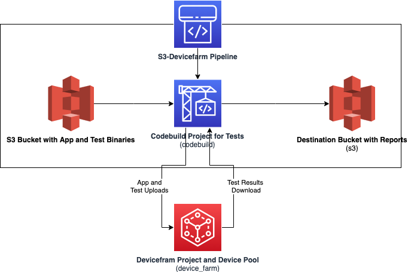

# Testing Mobile Apps in Devicefarm using a CI-CD pipeline

The objective of this sample is to help you to build a CI-CD pipeline to test mobile devices using the AWS Devicefarm. The sample makes use of the AWS Codepipeline service to connect build assets published to an Amazon S3 bucket to an AWS Devicefarm project. The code pipeline uses AWS CodeBuild for its testing stage to initiate the test runs on Devicefarm and gathers test results. These test results are then published back to an S3 bucket for further processing.

AWS Device Farm is an application testing service that lets you improve the quality of your web and mobile apps by testing them across an extensive range of desktop browsers and real mobile devices; without having to provision and manage any testing infrastructure. The service enables you to run your tests concurrently on multiple desktop browsers or real devices to speed up the execution of your test suite, and generates videos and logs to help you quickly identify issues with your app.

AWS CodeBuild is a fully managed continuous integration service that compiles source code, runs tests, and produces software packages that are ready to deploy. With CodeBuild, you don’t need to provision, manage, and scale your own build servers. CodeBuild scales continuously and processes multiple builds concurrently, so your builds are not left waiting in a queue. 

AWS CodePipeline is a fully managed continuous delivery service that helps you automate your release pipelines for fast and reliable application and infrastructure updates. CodePipeline automates the build, test, and deploy phases of your release process every time there is a code change, based on the release model you define.

## Architecture



## How it works

This code sample uses the AWS CDK to deploy all the services used. 

When deployment is done, you will have a devicefarm project with a device pool, an s3 bucket for storing app and test binaries as well as your test reults, an AWS CodeBuild project and an AWS CodePipeline for executing the CICD pipeline. 

The code pipeline is configured with 3 stages in sequence with various actions.

1. an S3 source action, which is triggered when you upload binaries to the source s3 bucket. The binaries are in turn sent to the next stage for code build 
2. a codebuild action, which uploads the app and test binaries into the Devicefarm. After the uploads are done, this stage triggers a test run in Devicefarm. The code build stage waits for the test run to complete and then downloads the results of the tests and send this to the next stage
3. an s3 deploy action, which receives the test results and stores the same in a folder in an s3 bucket.

The code build commands are configured using the buildspec.yml file inside the app/ folder. The command executes a python code for performing the binary uploads as well as scheduling the test run. The code also waits for the tests to complete and extracts the results into appropriate folders.

Please note that AWS Devicefarm not supported natively by the CDK at this time and hence we use CDK custom resources to provision the necessary infrastructure.

## Usage

- Install CDK in your local environment - `npm install -g aws-cdk`
- Clone the repository - `git clone https://github.com/aws-samples/s3-devicefarm-pipeline.git`
- From the root folder of the repository run `npm install`.
- From the root folder of the repository run `cdk bootstrap` and then `cdk deploy`. This will create the devicefarm project and setup a devicepool for you. 
- Note down the url of the s3 bucket created. 
- To run the tests you need to have an Android apk and a TestNG distribution with all dependencies in the app folder. You can build the apk from our sample app code at  https://github.com/aws-samples/aws-device-farm-sample-app-for-android and the tests zip can created by building the project at https://github.com/aws-samples/aws-device-farm-appium-tests-for-sample-app
- copy the output from the above builds to the `app` folder of this project. The apk should be named 'app-debug.apk' and the tests zip should be named 'zip-with-dependencies.zip'
- Change the permissions and the execute the `./uploadzip.sh` command using the commands below. Replace `<s3-url>` with the url noted above 
```
chmod a+x uploadzip.sh
./uploadzip.sh <s3-url>
``` 
- The upload will trigger the codepipeline and execute a test run in the devicefarm project. The results of the execution will be available in the same s3 bucket under an artifacts folder.

## Notes

- AWS Devicefarm is only available in us-west-2 region. Hence the deployment is hard-coded to use us-west-2. See the env property in bin/s3-df-pipeline.ts

- Though this repo works with Android app and TestNG Java tests, it is possible to change the file `app/run-devicefarm-tests.py` to support IOS apps and all the other test frameworks supported by devicefarm

- In case you are using a diffrent OS platform, make sure the device-pool created has appropriate devices (Android vs Ios). You can modify the devicepool by changing the devicepool rules specified in the `lib/s3-devicefarm-pipeline-stack.ts` file.

- Codepipeline integrates directly with source repositories in Github, CodeCommit and Bitbucket. If you are using non-supported sources such as Gitlab, the source could be build in gitlab and binaries pushed to an S3 bucket as demonstrated in this example

- In some environments, after installing the cdk using `npm install -g aws-cdk` you will need to add the cdk binary to your path before you can execute the cdk commands.

## Security

See [CONTRIBUTING](CONTRIBUTING.md#security-issue-notifications) for more information.

## License

This library is licensed under the MIT-0 License. See the LICENSE file.

